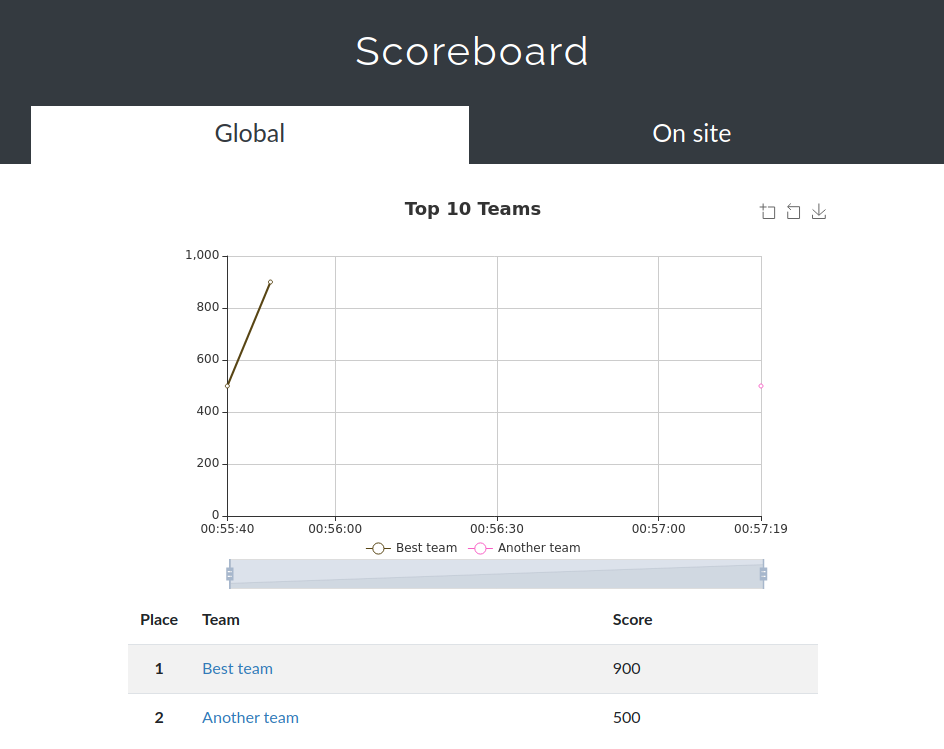

# CTFd Multiple Scoreboards Plugin

This plugin allows you to separate [CTFd](https://github.com/CTFd/CTFd) teams into categories, with a separate scoreboard for each category.
This could for example be useful to separate people attending a CTF physically from those joining remotely.

# Setup

1. Copy this repository to a folder under `CTFd/plugins/` in your CTFd instance.
1. Log in as an admin, go to `Admin Panel`->`Config`->`Custom Fields`
1. Under Teams, add one Custom Field for each additional scoreboard you want. The `Field Name` will be the title of the scoreboard.
1. In addition to the custom scoreboards you added, `Global` will be a category with _all_ teams.
1. Happy hacking!

